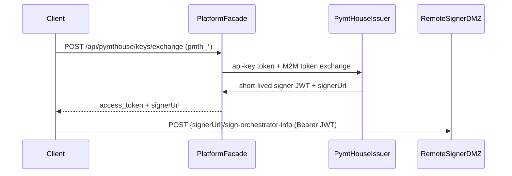

# @pymthouse/builder-sdk

Source repository: [pymthouse/builder-sdk](https://github.com/pymthouse/builder-sdk). The npm package name is `@pymthouse/builder-sdk`.

TypeScript client for the **PymtHouse Builder API**, **Usage API**, and **OIDC issuer** surfaces.

OAuth/OIDC protocol calls use **[oauth4webapi](https://github.com/panva/oauth4webapi)** (OpenID-certified relying-party implementation). PymtHouse-specific REST paths and helpers live in `PmtHouseClient`.

## Install

```bash
pnpm add @pymthouse/builder-sdk
```

Maintainers: see [docs/RELEASING.md](docs/RELEASING.md) for trusted publishing and re-running failed releases.

## Quick start

```ts
import { PmtHouseClient } from "@pymthouse/builder-sdk";
import {
  createPmtHouseClientFromEnv,
  getPymthouseBaseUrl,
} from "@pymthouse/builder-sdk/env";

const client = createPmtHouseClientFromEnv();
const base = getPymthouseBaseUrl();
const discovery = await client.getDiscovery();
```

Or construct explicitly:

```ts
import { PmtHouseClient } from "@pymthouse/builder-sdk";

const client = new PmtHouseClient({
  issuerUrl: process.env.PYMTHOUSE_ISSUER_URL!,
  publicClientId: process.env.PYMTHOUSE_PUBLIC_CLIENT_ID!,
  m2mClientId: process.env.PYMTHOUSE_M2M_CLIENT_ID!,
  m2mClientSecret: process.env.PYMTHOUSE_M2M_CLIENT_SECRET!,
  allowInsecureHttp: process.env.PYMTHOUSE_ISSUER_URL?.startsWith("http:"),
});
```

## User tokens: short-lived JWT or long-lived signer session

Use `mintUserAccessToken()` when your backend needs the short-lived
Builder-minted user JWT directly:

```ts
const userJwt = await client.mintUserAccessToken({
  externalUserId: "naap-user-123",
  scope: "sign:job",
});
```

Use `mintUserSignerSessionToken()` when you want the user-facing opaque
`pmth_...` signer session. This first mints the short-lived user JWT, then
performs the RFC 8693 token exchange with the confidential M2M client:

```ts
const signerSession = await client.mintUserSignerSessionToken({
  externalUserId: "naap-user-123",
  scope: "sign:job",
});
```

For advanced flows that already have a user JWT, call
`exchangeForSignerSession({ userJwt })` directly.

### Dashboard API keys (long-lived `pmth_*`)

Create a key in the Dashboard **API keys** page, then exchange it for a short-lived
signer JWT without repeating device login. The facade mints credentials only;
signing RPCs go **directly to the remote signer DMZ** returned as `signer_url`.

```ts
import {
  DIRECT_SIGNER_PATHS,
  exchangeApiKeyForSigner,
  signerEndpointUrl,
} from "@pymthouse/builder-sdk/signer/server";

const session = await exchangeApiKeyForSigner({
  facadeUrl: process.env.DASHBOARD_ORIGIN!, // exchange only
  apiKey: process.env.PMTH_API_KEY!,
  scope: "sign:job",
  clientId: process.env.PYMTHOUSE_PUBLIC_CLIENT_ID!,
});

const signerBase = session.signer_url!; // remote signer DMZ from exchange
const orchInfo = await fetch(
  signerEndpointUrl(signerBase, DIRECT_SIGNER_PATHS.signOrchestratorInfo),
  {
    method: "POST",
    headers: {
      Authorization: `Bearer ${session.access_token}`,
      "Content-Type": "application/json",
    },
    body: JSON.stringify({ /* ... */ }),
  },
);
```

Or via `PmtHouseClient` (returns `signer_url` when using `facadeUrl`):

```ts
const session = await client.exchangeApiKeyForSignerSession({
  apiKey: process.env.PMTH_API_KEY!,
  facadeUrl: process.env.DASHBOARD_ORIGIN!,
  scope: "sign:job",
});
// session.access_token — short-lived signer JWT
// session.signer_url — remote signer DMZ base (call signer RPCs here directly)
```

See `examples/stream-with-api-key.mjs` for a minimal Node script.

### Exchange then direct signer (architecture)



**Do not** point `signerUrl` or gateway `--token signer` at dashboard
`/api/signer/*` proxy routes. Those proxies are removed; use the remote signer
DMZ URL from the exchange response (or `getSignerRouting().remoteDmzUrl`).

**Migration:** if you previously configured
`signer: https://dashboard.example.com/api/signer`, change to the remote signer
base returned by exchange (`signerUrl`) or routing (`remoteDmzUrl`). Keep
`facadeUrl` / `billing` pointed at the dashboard/platform origin for exchange
only (`/api/pymthouse/keys/exchange` or `/api/signer/device/exchange`).

Integrators can use the higher-level workflow helpers:

```ts
const session = await client.mintSignerSessionForExternalUser({
  externalUserId: "naap-user-123",
  email: "user@example.com",
});
// session.accessToken is opaque pmth_…

await client.approveDeviceLogin({
  externalUserId: "naap-user-123",
  userCode: "ABCD-EFGH",
  publicClientId: process.env.PYMTHOUSE_PUBLIC_CLIENT_ID,
});
```

## Usage API: session-scoped `scope=me` BFF helper

```ts
const payload = await client.fetchUsageForExternalUser({
  externalUserId: "naap-user-123",
  startDate,
  endDate,
});
// payload.currentUser includes fiat totals + merged pipelineModels
```

## App manifest

```ts
const { manifest, etag, notModified } = await client.getAppManifest({
  ifNoneMatch: cachedEtag ?? undefined,
});
```

## Remote signer identity webhook

For go-livepeer `-remoteSignerWebhookUrl` deployments, builder-sdk provides the
reference **integration security** webhook that validates end-user credentials and
returns `UsageIdentity` to the signer (`POST /authorize`).

Transport (signer shared-secret auth, wire protocol) is separate from **end-user
auth strategies** (`EndUserAuthVerifier`). OIDC/JWT is the default; an API-key
adapter and a composite "first match" adapter are also provided, and you can
plug in any custom verifier.

```ts
import {
  createApiKeyEndUserVerifier,
  createOidcRemoteSignerWebhookConfig,
  createRemoteSignerAuthorizeHandler,
  type EndUserAuthVerifier,
} from "@pymthouse/builder-sdk/signer/webhook";

// OIDC (default): Auth0, pymthouse issuer, etc.
const authorize = createRemoteSignerAuthorizeHandler(
  createOidcRemoteSignerWebhookConfig({
    webhookSecret: process.env.WEBHOOK_SECRET!,
    jwtIssuer: process.env.JWT_ISSUER!,
    jwtAudience: process.env.JWT_AUDIENCE!,
    claimMapping: { claimClientId: "azp", usageSubjectType: "auth0_user_id" },
  }),
);

// API key: resolve your own keys to a UsageIdentity
const apiKeyVerifier = createApiKeyEndUserVerifier({
  issuer: process.env.JWT_ISSUER!,
  resolveApiKey: async (key) => (await lookup(key)) ?? null,
});

// Custom provider: implement EndUserAuthVerifier
const customConfig = {
  webhookSecret: process.env.WEBHOOK_SECRET!,
  endUserAuth: {
    kind: "custom",
    verify: async ({ authorization, payload, request }) => {
      // validate provider credentials, return UsageIdentity
      return { identity: { ... }, expiry: Math.trunc(Date.now() / 1000) + 300 };
    },
  } satisfies EndUserAuthVerifier,
};
```

Env vars align with `auth0-livepeer` bootstrap output (`.env.livepeer`). For Auth0,
set `CLAIM_CLIENT_ID=azp` and `USAGE_SUBJECT_TYPE=auth0_user_id`.

## Gateway `--token` helper

The [livepeer-python-gateway](https://github.com/livepeer/livepeer-python-gateway)
`--token` is a **base64-encoded JSON** bundle (not a JWT). `buildGatewayToken`
assembles one client-side from values you already have, and `mintGatewayToken`
mints a signer JWT first as a convenience.

Two gateway auth modes:

- **`signerJwt`** — you mint a signer JWT and forward it as
  `signer_headers.Authorization = "Bearer <jwt>"`. The gateway only reads the
  JWT `exp`; it cannot refresh on its own (pre-mint or refresh externally).
- **`pmthApiKey`** — the gateway holds a `pmth_*` API key + the billing URL and
  performs the exchange + auto-refresh itself (`api_key` + `billing` top-level).

```ts
import {
  buildGatewayToken,
  mintGatewayToken,
} from "@pymthouse/builder-sdk/signer/gateway";

// Pure assembly: pre-minted signer JWT mode
const token = buildGatewayToken({
  signer: "https://signer.example/generate-live-payment",
  auth: { kind: "signerJwt", accessToken: userSignerJwt },
});

// Pure assembly: gateway self-refreshes via platform exchange, signs directly to signer
const apiKeyToken = buildGatewayToken({
  signer: "https://signer.example",
  auth: {
    kind: "pmthApiKey",
    apiKey: process.env.PMTH_API_KEY!,
    billing: "https://dashboard.example.com",
  },
});

// Convenience: mint a signer JWT (M2M client_credentials) then assemble
const minted = await mintGatewayToken({
  source: "m2m",
  signer: "https://signer.example/generate-live-payment",
  issuerUrl: process.env.PYMTHOUSE_ISSUER_URL!,
  m2mClientId: process.env.PYMTHOUSE_M2M_CLIENT_ID!,
  m2mClientSecret: process.env.PYMTHOUSE_M2M_CLIENT_SECRET!,
  externalUserId: "naap-user-123",
});
// Pass `token` straight to the gateway: `--token <token>`
```

Use `decodeGatewayToken(token)` to inspect a bundle in tests/debugging.

## Subpath exports

| Import | Purpose |
|--------|---------|
| `@pymthouse/builder-sdk` | `PmtHouseClient`, usage helpers, manifest parsers, token helpers |
| `@pymthouse/builder-sdk/signer/server` | Exchange handlers, direct signer URL helpers, minting, `buildGatewayToken`/`mintGatewayToken` |
| `@pymthouse/builder-sdk/signer/gateway` | Gateway `--token` assembler (`buildGatewayToken`, `mintGatewayToken`, `decodeGatewayToken`) |
| `@pymthouse/builder-sdk/signer/webhook` | Identity webhook for `-remoteSignerWebhookUrl` |
| `@pymthouse/builder-sdk/config` | `isPymthouseConfigured`, `readPymthouseEnv` (Edge/middleware-safe) |
| `@pymthouse/builder-sdk/tokens` | Signer session TTL, JWT shape helpers, `parseSignerSessionExchange` |
| `@pymthouse/builder-sdk/format` | Wei formatting for Usage API |
| `@pymthouse/builder-sdk/env` | `createPmtHouseClientFromEnv`, `getPymthouseBaseUrl` (server-only) |
| `@pymthouse/builder-sdk/device` | RFC 8628 `pollDeviceToken` |
| `@pymthouse/builder-sdk/device-initiate` | Option B device login validation (Edge-safe) |
| `@pymthouse/builder-sdk/verify` | RFC 9068 `verifyJwt` |

## Usage API: duplicate `byUser` rows

When `getUsage({ groupBy: "user" })` returns multiple `byUser` rows with the same
`externalUserId`, sum them with `summarizeUsageForExternalUser` (or
`aggregateUsageByExternalUserId` on `byUser` alone):

```ts
import { summarizeUsageForExternalUser } from "@pymthouse/builder-sdk";

const usage = await client.getUsage({ groupBy: "user", startDate, endDate });
const summary = summarizeUsageForExternalUser(usage, externalUserId);
// summary.requestCount, summary.feeWei (wei string)
```

## Billing: plans, retail usage, signed-ticket ingest

**Plans (apiVersion=2):** `listBillingProducts({ apiVersion: "2" })` returns `BillingProduct[]` with capability pricing and sync status. `syncBillingProduct(planId)` POSTs to OpenMeter.

**Retail estimates:** `getUsage({ includeRetail: true, groupBy: "pipeline_model" })` adds `endUserBillableUsdMicros` / fiat rows when the active plan has retail rates.

**Metering:** after exchange, sign directly against the remote signer DMZ with
`forwardToSigner`, `forwardDirectSignerRequest`, or plain `fetch` to
`{signer_url}/{path}`. Usage is emitted asynchronously by go-livepeer to Kafka
and ingested by the OpenMeter collector. Dashboard `/api/signer/*` HTTP proxy
routes and synchronous HTTP signed-ticket ingest are removed.

**Routing:** `getSignerRouting()` returns the remote DMZ URL and webhook URL (`patterns.directDmz`).

**Allowances (OpenMeter):** Trial and manual USD micros allowance use OpenMeter entitlements — not a Postgres wei ledger.

| Method | SDK | HTTP |
|--------|-----|------|
| Read balance | `getUsageBalance(externalUserId)` | `GET .../usage/balance?externalUserId=` |
| Read allowance detail | `getUserAllowances(externalUserId)` | `GET .../users/{id}/allowances` |
| Top-up grant | `grantUserAllowance(externalUserId, { amountUsdMicros, source })` | `POST .../users/{id}/allowances` |

**Plan pricing helpers:** `markupPercentToRetailRateUsd`, `applyRetailRateToNetworkMicros` (exported from the main entry).

## Usage API: pipeline/model grouping

When `getUsage({ groupBy: "pipeline_model", startDate, endDate, userId })` returns
`byPipelineModel`, use `listUsageByPipelineModel` for a stable-sorted copy. Pass
the optional `gatewayRequestId` filter to scope results to a single upstream
gateway request:

```ts
import { listUsageByPipelineModel } from "@pymthouse/builder-sdk";

const usage = await client.getUsage({
  groupBy: "pipeline_model",
  startDate,
  endDate,
  userId: internalUserId,
  gatewayRequestId, // optional: filter to a single gateway request
});
const rows = listUsageByPipelineModel(usage);
```

## Documentation

Authoritative API behavior: [PymtHouse `docs/builder-api.md`](https://github.com/pymthouse/pymthouse/blob/main/docs/builder-api.md).

## Server-only: `createPmtHouseClientFromEnv` / `@pymthouse/builder-sdk/env`

M2M credentials are **confidential**. The `env` entry point:

1. **Throws as soon as the module loads in a browser** (detects `globalThis.window`), so a mistaken client import fails immediately instead of silently bundling secrets.
2. Does **not** stop someone from putting `m2mClientSecret` in `new PmtHouseClient({ ... })` in client code—you still must not do that.

**Next.js — build-time guard (optional):** in a file that is only used from the server, add the official marker so the bundler errors instead of shipping the module to the client:

```ts
// e.g. lib/pymthouse-server.ts
import "server-only";

export {
  createPmtHouseClientFromEnv,
  getPymthouseBaseUrl,
} from "@pymthouse/builder-sdk/env";
```

Import `createPmtHouseClientFromEnv` only from that wrapper (or from Route Handlers / Server Actions directly).

## Next.js (monorepo) consumption

When the SDK lives as a sibling folder (e.g. `../node-pymt-sdk`), enable `experimental.externalDir` in `next.config` and re-export from a small `lib` shim that points at `../../node-pymt-sdk` (see the `website` app in this org). Published installs from npm use the package name directly without shims.

## License

MIT
