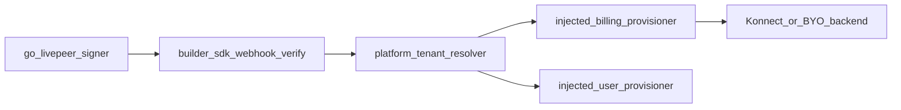

# Builder-SDK architecture boundaries

Builder-sdk is a **stateless protocol and contract library**. It does not own tenant
configuration, credential storage, or platform admin APIs.

## In scope (builder-sdk)

| Concern | Module | Notes |
|---------|--------|-------|
| Remote signer webhook verify | `signer/webhook` | JWT/OIDC, API key, trusted headers |
| Identity claim mapping | `signer/webhook/identity` | `auth_id = "{clientId}:{usageSubject}"` |
| Billing customer key format | `billing/openmeter/customer-key` | `{clientId}:{externalUserId}` |
| Provisioning **ports** (interfaces) | `signer/webhook/ports` | Injected by the host app |
| Optional Konnect/OpenMeter adapter | `billing/openmeter` | Implements ports when host passes a client |
| Auth0 Management helpers | `auth0/management` | Thin API wrapper, no tenancy |

## Out of scope (platform apps)

Platform applications (`pymthouse`, `clearinghouse` admin service) own:

- Per-tenant `OPENMETER_URL` / API key storage (DB or secrets manager)
- Backend selection: hosted Konnect vs BYO OpenMeter (`appOpenMeterConfig` in pymthouse)
- Default plan policy per app/tenant
- Admin authz and CRUD (`POST /api/v1/apps/{id}/users`, etc.)
- Resolving which `clientId` + `planKey` apply for a provision request



## Who depends on builder-sdk

| Consumer | Uses |
|----------|------|
| identity-webhook (clearinghouse compose) | Webhook verify + injected single-tenant provisioner |
| pymthouse `/webhooks/remote-signer` | Webhook verify (no billing in webhook today) |
| pymthouse app APIs | Ports/adapters via `provisionAppUserBilling`; tenant resolver in app layer |
| End-user SDK / CLI | `PmtHouseClient`, device flow, tokens |

Apps **must not** expect builder-sdk to read per-tenant billing config from a database.

## Wiring patterns

### Single-tenant (clearinghouse compose)

Global env vars; one provisioner instance at process start:

```ts
import { createOpenMeterBillingProvisioner } from "@pymthouse/builder-sdk/billing/openmeter";
import { createAuth0BillingWebhookConfig } from "@pymthouse/builder-sdk/signer/webhook";

const billingProvisioner = createOpenMeterBillingProvisioner({
  client: openMeterClient,
  defaultPlanKey: process.env.OPENMETER_DEFAULT_PLAN_KEY!,
});

createAuth0BillingWebhookConfig({
  webhookSecret,
  jwtIssuer,
  jwtAudience,
  billingProvisioner,
  userProvisioner: auth0Management ? createAuth0UserProvisioner(auth0Management) : undefined,
});
```

### Multi-tenant (pymthouse-style)

Resolve backend per `clientId` in the platform layer, then call the same port:

```ts
const billingProvisioner: BillingProvisionerPort = {
  async provisionCustomer(input) {
    const config = await resolveAppOpenMeterConfig(input.clientId);
    const client = await getOpenMeterClientForApp(input.clientId);
    const planKey = await resolveDefaultPlanKeyForApp(input.clientId);
    return provisionBillingCustomer(client!, {
      clientId: input.clientId,
      externalUserId: input.externalUserId,
      planKey,
      displayName: input.displayName,
    });
  },
};
```

Reference: `pymthouse/src/lib/openmeter/client-factory.ts`, `pymthouse/src/lib/billing/provision-app-user.ts`.

## Admin customer API

`createCustomerProvisionAdminRoutes` is a **reusable route primitive** (auth + JSON +
port calls). The platform chooses whether to mount it on the identity-webhook
(single-tenant clearinghouse) or on a dedicated admin API (multi-tenant). Prefer
app-level admin APIs (`/api/v1/apps/{id}/users`) for multi-tenant products.

## Migration note

Webhook helpers previously accepted a raw `@openmeter/sdk` client. Use
`BillingProvisionerPort` and `createOpenMeterBillingProvisioner` instead. The OpenMeter
client remains an optional integration detail, not a webhook dependency.
